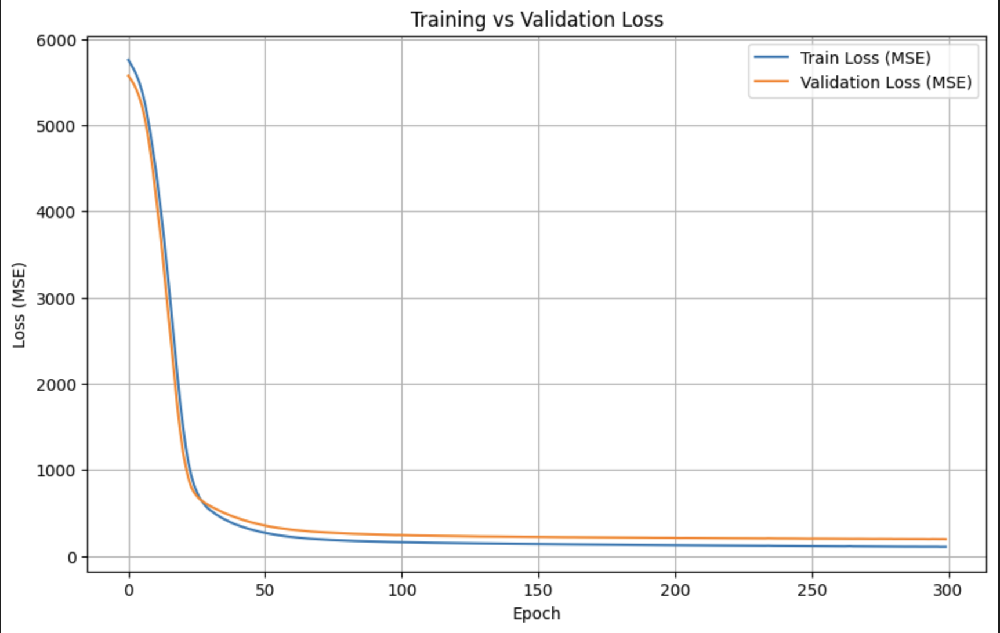

# Productivity Score Prediction

## Summary
This project builds and compares four different deep learning models to predict a productivity score based on various features. Tests models built with Keras Seqeuntial and Functional to measures best performing architecture. This project can related into working effectiveness because its including important features that mostly impact productivity such as working hours, day, and overtime.

## Problem
1. Identifiy Key Drivers: understand which factors the most influence productivity
2. Allocate Resources: Support teams for lower productivity
3. Set benchmarks: Create goals and expectations
   
## Methodology
1. EDA & Preprocessing (handling anomalies (no friday?, negative productivity score?), formating date in the same format, is the actual date and date columns actually matching, Scaling, and Encoding)
2. Modeling
3. Evaluation
   
## Skills
1. Python: Pandas, Seaborn, and Matplotlib
2. Scikit-Learn: OneHotEncoder, train_test_split)
3. Deep Learning Frameworks: Tensoflow/Keras, Sequential, Functional 
   
## Results

1. Modified Sequential model the best performing model
2. Highest model with R² Score of 0.3724, indicating the variance in the productivity score
3. Lowest Mean Absolute Error (MAE) is the most accurate and reliable predictor
   
## Next Steps
1. Hyperparameter tuning:
2. Feature engineering: further investigate to creating new ones to capture more complex patterns and increase predictive power
3. Benchmark with other neutral networks performance: RandomForestRegressor or XGBoostRegressor
